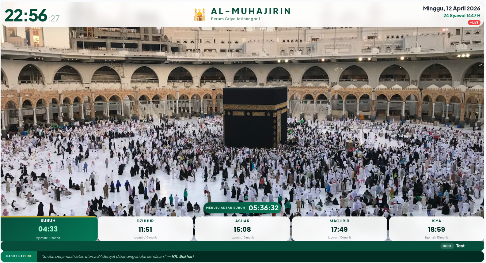
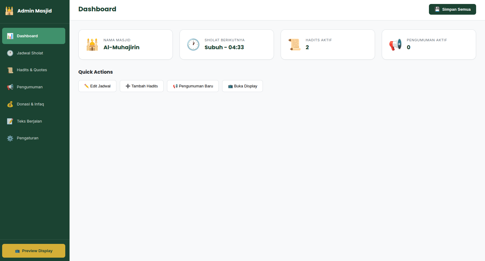

# Masjid Display System

A lightweight web-based mosque display system designed for TV/kiosk displays (STB devices). Features a fullscreen display for prayer times and a mobile-friendly admin panel.

## Demo

### TV Display



### Admin Panel



## Quick Start

```bash
# Development
npm install
npm start

# Docker (Production)
docker compose up -d --build
```

- **Display**: http://localhost:3000/display (or port 5000 in Docker)
- **Admin**: http://localhost:3000/admin

## Features

### Display Page (`/display`)

- Real-time clock and date
- Prayer schedule with countdown to next adzan
- Iqomah countdown with beep alert
- Calm mode during prayer
- Rotating hadiths
- Running text ticker (marquee)
- Customizable background image
- Live indicator badge

### Admin Panel (`/admin`)

- Mosque settings (name, logo, tagline, address, phone)
- Prayer times and iqomah duration configuration
- Hadith management (CRUD)
- Donation tracking (CRUD)
- Announcement management with priority and expiry
- Running text management
- Background image upload

## Architecture

```
┌─────────────────────────────────────────────────────────┐
│                     Express Server                       │
│                      (server.js)                         │
├─────────────────────────────────────────────────────────┤
│  /api/*  │  REST API (CRUD for all resources)           │
│  /public │  Static files (HTML, CSS, JS)                │
├─────────────────────────────────────────────────────────┤
│              SQLite (better-sqlite3)                     │
│              Data stored in ./masjid.db                  │
│              Docker: /app/data/masjid.db                 │
└─────────────────────────────────────────────────────────┘
```

## File Structure

```
masjid-display-jws/
├── server.js           # Express server + all API routes + DB schema
├── package.json        # Dependencies: express, better-sqlite3, cors
├── docker-compose.yml  # Docker config (port 5000:3000, TZ: Asia/Jakarta)
├── Dockerfile          # Node 18 Alpine, copies public/ into image
├── docs/
│   └── image/
│       ├── ui-display.png   # Display screenshot
│       └── ui-admin.png     # Admin screenshot
└── public/
    ├── display.html    # Main TV display page
    ├── display.js      # Display logic (clock, prayer state machine, marquee)
    ├── style.css       # Display styles (viewport-relative, CSS Grid layout)
    ├── admin.html      # Admin panel SPA
    ├── admin.js        # Admin logic (CRUD operations, modals)
    └── admin.css       # Admin styles
```

## Database Schema

SQLite tables created on startup:

| Table | Columns | Notes |
|-------|---------|-------|
| `settings` | `key` (PK), `value` | Key-value store for mosque config |
| `prayer_times` | `id`, `name`, `time`, `iqomah_duration` | 5 prayers: Subuh, Dzuhur, Ashar, Maghrib, Isya |
| `hadiths` | `id`, `text`, `source`, `is_active`, `created_at` | Rotating quotes on display |
| `donations` | `id`, `category`, `amount`, `target`, `description`, `updated_at` | Donation tracking |
| `announcements` | `id`, `title`, `content`, `priority`, `status`, `expiry_date`, `created_at` | Announcements |
| `running_texts` | `id`, `text`, `category`, `priority`, `is_active` | Marquee ticker items |

## API Endpoints

### Settings
- `GET /api/settings` - Get all settings as object
- `POST /api/settings` - Update settings (key-value pairs in body)

### Prayer Times
- `GET /api/prayers` - Get all 5 prayers
- `PUT /api/prayers/:id` - Update time/iqomah_duration

### Hadiths
- `GET /api/hadiths` - All hadiths
- `GET /api/hadiths/active` - Active only
- `POST /api/hadiths` - Create
- `PUT /api/hadiths/:id` - Update
- `DELETE /api/hadiths/:id` - Delete

### Donations
- `GET /api/donations` - All donations
- `POST /api/donations` - Create
- `PUT /api/donations/:id` - Update
- `DELETE /api/donations/:id` - Delete

### Announcements
- `GET /api/announcements` - All
- `GET /api/announcements/published` - Published + not expired
- `POST /api/announcements` - Create
- `PUT /api/announcements/:id` - Update
- `DELETE /api/announcements/:id` - Delete

### Running Texts
- `GET /api/running-texts` - All
- `GET /api/running-texts/active` - Active only (for display)
- `POST /api/running-texts` - Create
- `PUT /api/running-texts/:id` - Update
- `DELETE /api/running-texts/:id` - Delete

### Combined State
- `GET /api/state` - Returns `{ settings, prayers, hadiths, announcements, runningTexts, serverTime }` - Used by display page for single fetch

## Display State Machine

The display uses a state machine for prayer flow:

```
IDLE → WAITING_ADZAN → ADZAN → IQOMAH → PRAYER → FINISHED → IDLE
```

- **IDLE**: Shows countdown to next prayer
- **WAITING_ADZAN**: 1 minute before adzan
- **ADZAN**: Adzan time
- **IQOMAH**: Iqomah countdown with beep alert
- **PRAYER**: Calm mode (dimmed UI)
- **FINISHED**: Post-prayer state before returning to IDLE

## Settings

| Key | Default | Description |
|-----|---------|-------------|
| `mosque_name` | "Masjid Al-Muhajirin" | Display header |
| `mosque_logo` | "🕌" | Emoji logo |
| `mosque_tagline` | "Baitullah untuk Umat" | Subtitle |
| `mosque_address` | "" | Address |
| `mosque_phone` | "" | Phone |
| `background_image` | "" | Base64 data URL |
| `hadith_rotation_interval` | "30" | Seconds between hadith rotation |
| `show_live_indicator` | "true" | Show LIVE badge |
| `marquee_loop` | "true" | Seamless marquee loop |
| `marquee_speed` | "30" | Marquee duration (seconds) |
| `marquee_gap` | "4" | Gap between marquee items (rem) |

## Technology Stack

- **Backend**: Express.js + SQLite (better-sqlite3)
- **Frontend**: Vanilla HTML/CSS/JavaScript
- **Port**: 3000 (internal), 5000 (Docker)
- **Timezone**: Asia/Jakarta (WIB, UTC+7)

## Deployment Notes

- Port mapping: Docker maps 5000 → 3000 internally
- Data persistence: `masjid-data` volume for SQLite database
- No hot reload in production - must rebuild Docker image for code changes

## License

MIT
